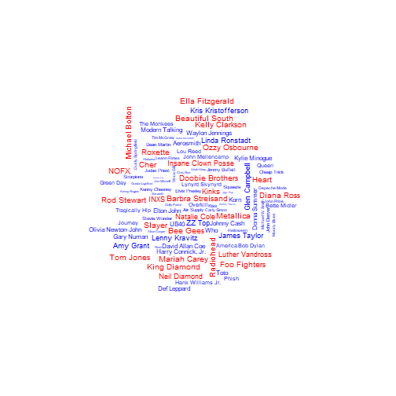
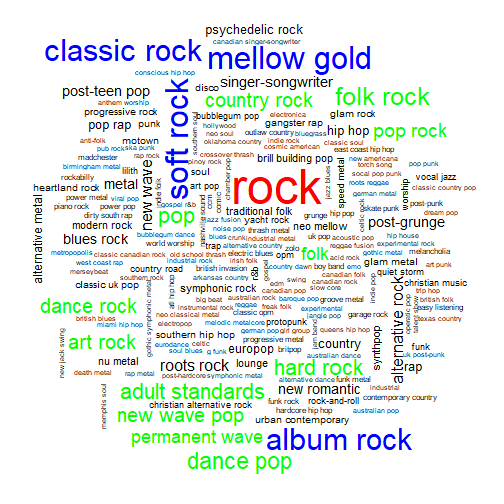
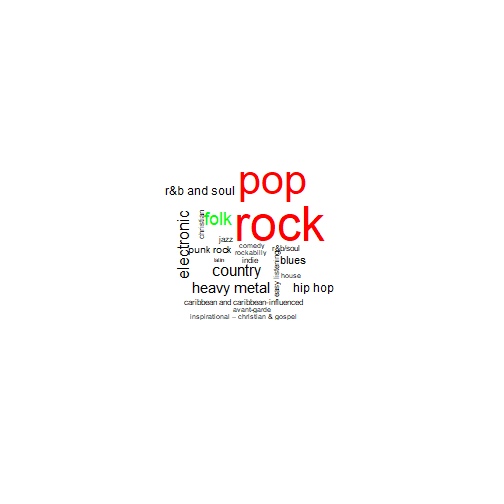
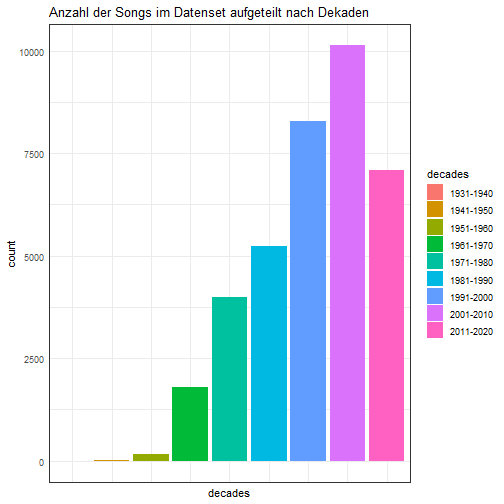
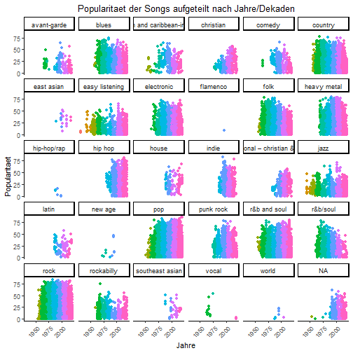

Deskriptive Analyse des Musikdatensets
========================================================
author: Michael Angerer & Patrick Zivkovic
date: 21.04.2020
autosize: true

Ein Einblick in das Ursprungs-Datenset
========================================================

<table>
 <thead>
  <tr>
   <th style="text-align:left;"> artist </th>
   <th style="text-align:left;"> song </th>
   <th style="text-align:left;"> link </th>
   <th style="text-align:left;"> text </th>
  </tr>
 </thead>
<tbody>
  <tr>
   <td style="text-align:left;"> ABBA </td>
   <td style="text-align:left;"> Ahe's My Kind Of Girl </td>
   <td style="text-align:left;"> /a/abba/ahes+my+kind+of+girl_20598417.html </td>
   <td style="text-align:left;"> Beispieltext </td>
  </tr>
  <tr>
   <td style="text-align:left;"> ABBA </td>
   <td style="text-align:left;"> Andante, Andante </td>
   <td style="text-align:left;"> /a/abba/andante+andante_20002708.html </td>
   <td style="text-align:left;"> Beispieltext </td>
  </tr>
  <tr>
   <td style="text-align:left;"> ABBA </td>
   <td style="text-align:left;"> As Good As New </td>
   <td style="text-align:left;"> /a/abba/as+good+as+new_20003033.html </td>
   <td style="text-align:left;"> Beispieltext </td>
  </tr>
  <tr>
   <td style="text-align:left;"> ABBA </td>
   <td style="text-align:left;"> Bang </td>
   <td style="text-align:left;"> /a/abba/bang_20598415.html </td>
   <td style="text-align:left;"> Beispieltext </td>
  </tr>
  <tr>
   <td style="text-align:left;"> ABBA </td>
   <td style="text-align:left;"> Bang-A-Boomerang </td>
   <td style="text-align:left;"> /a/abba/bang+a+boomerang_20002668.html </td>
   <td style="text-align:left;"> Beispieltext </td>
  </tr>
  <tr>
   <td style="text-align:left;"> ABBA </td>
   <td style="text-align:left;"> Burning My Bridges </td>
   <td style="text-align:left;"> /a/abba/burning+my+bridges_20003011.html </td>
   <td style="text-align:left;"> Beispieltext </td>
  </tr>
</tbody>
</table>

Was haben wir bereits gemacht
========================================================

- cleanen der Songnamen
    - `stringdist`-package: OSA (Optimal String Alignment/restricted Damerau-Levenshtein distance) Algorithmus
    - heisst: eine Loeschung, Einfuegung oder Austausch von Charakter wird in Kauf genommen (entspricht dist=1)
    - wir haben maxDist = 2 (2 Loeschungen, Einfuegungen oder Austaeusche) gewaehlt - zeigt gute Performance
- Daten anreichern mit Spotify-Daten (ueber Spotify-Api)
    - Popularitaetsscore (Song und Kuenstler)
    - Lieddauer
    - Erscheinungsjahr des Songs
    - Kuenstler Genre (genauer hat es Spotify nicht)
    
Details zum Datenset
========================================================

- 36718 Songs
- 590 verschiedene Künstler (rund 62 Songs pro Künstler)

<table>
 <thead>
  <tr>
   <th style="text-align:left;"> artist </th>
   <th style="text-align:right;"> songs </th>
  </tr>
 </thead>
<tbody>
  <tr>
   <td style="text-align:left;"> George Strait </td>
   <td style="text-align:right;"> 172 </td>
  </tr>
  <tr>
   <td style="text-align:left;"> Randy Travis </td>
   <td style="text-align:right;"> 162 </td>
  </tr>
  <tr>
   <td style="text-align:left;"> Reba Mcentire </td>
   <td style="text-align:right;"> 158 </td>
  </tr>
  <tr>
   <td style="text-align:left;"> Iggy Pop </td>
   <td style="text-align:right;"> 156 </td>
  </tr>
  <tr>
   <td style="text-align:left;"> Alice Cooper </td>
   <td style="text-align:right;"> 154 </td>
  </tr>
  <tr>
   <td style="text-align:left;"> Joni Mitchell </td>
   <td style="text-align:right;"> 154 </td>
  </tr>
  <tr>
   <td style="text-align:left;"> Chris Rea </td>
   <td style="text-align:right;"> 153 </td>
  </tr>
  <tr>
   <td style="text-align:left;"> Kenny Rogers </td>
   <td style="text-align:right;"> 153 </td>
  </tr>
  <tr>
   <td style="text-align:left;"> Alabama </td>
   <td style="text-align:right;"> 152 </td>
  </tr>
  <tr>
   <td style="text-align:left;"> Dolly Parton </td>
   <td style="text-align:right;"> 152 </td>
  </tr>
  <tr>
   <td style="text-align:left;"> Uriah Heep </td>
   <td style="text-align:right;"> 152 </td>
  </tr>
</tbody>
</table>

Anzahl der Künstler
========================================================

<table>
 <thead>
  <tr>
   <th style="text-align:left;"> artist </th>
   <th style="text-align:right;"> songs </th>
  </tr>
 </thead>
<tbody>
  <tr>
   <td style="text-align:left;"> George Strait </td>
   <td style="text-align:right;"> 172 </td>
  </tr>
  <tr>
   <td style="text-align:left;"> Randy Travis </td>
   <td style="text-align:right;"> 162 </td>
  </tr>
  <tr>
   <td style="text-align:left;"> Reba Mcentire </td>
   <td style="text-align:right;"> 158 </td>
  </tr>
  <tr>
   <td style="text-align:left;"> Iggy Pop </td>
   <td style="text-align:right;"> 156 </td>
  </tr>
  <tr>
   <td style="text-align:left;"> Alice Cooper </td>
   <td style="text-align:right;"> 154 </td>
  </tr>
  <tr>
   <td style="text-align:left;"> Joni Mitchell </td>
   <td style="text-align:right;"> 154 </td>
  </tr>
  <tr>
   <td style="text-align:left;"> Chris Rea </td>
   <td style="text-align:right;"> 153 </td>
  </tr>
  <tr>
   <td style="text-align:left;"> Kenny Rogers </td>
   <td style="text-align:right;"> 153 </td>
  </tr>
  <tr>
   <td style="text-align:left;"> Alabama </td>
   <td style="text-align:right;"> 152 </td>
  </tr>
  <tr>
   <td style="text-align:left;"> Dolly Parton </td>
   <td style="text-align:right;"> 152 </td>
  </tr>
  <tr>
   <td style="text-align:left;"> Uriah Heep </td>
   <td style="text-align:right;"> 152 </td>
  </tr>
</tbody>
</table>

Ein Einblick in unser Datenset
========================================================

<table class="table" style="margin-left: auto; margin-right: auto;">
 <thead>
  <tr>
   <th style="text-align:left;"> artist </th>
   <th style="text-align:left;"> song </th>
   <th style="text-align:left;"> song_name </th>
   <th style="text-align:left;"> song_id </th>
   <th style="text-align:left;"> text </th>
   <th style="text-align:left;"> artist_id </th>
   <th style="text-align:right;"> popularity </th>
   <th style="text-align:right;"> duration_ms </th>
   <th style="text-align:right;"> year </th>
   <th style="text-align:left;"> artist_genre </th>
   <th style="text-align:right;"> artist_popularity </th>
   <th style="text-align:right;"> duration_s </th>
   <th style="text-align:left;"> decades </th>
  </tr>
 </thead>
<tbody>
  <tr>
   <td style="text-align:left;"> ABBA </td>
   <td style="text-align:left;"> Ahe's My Kind Of Girl </td>
   <td style="text-align:left;"> She's My Kind Of Girl </td>
   <td style="text-align:left;"> 5Ca2lylmEMrqTOGGf9jJVw </td>
   <td style="text-align:left;"> Beispieltext </td>
   <td style="text-align:left;"> 0LcJLqbBmaGUft1e9Mm8HV </td>
   <td style="text-align:right;"> 19 </td>
   <td style="text-align:right;"> 164586 </td>
   <td style="text-align:right;"> 1973 </td>
   <td style="text-align:left;"> europop, swedish pop </td>
   <td style="text-align:right;"> 79 </td>
   <td style="text-align:right;"> 165 </td>
   <td style="text-align:left;"> 1971-1980 </td>
  </tr>
  <tr>
   <td style="text-align:left;"> ABBA </td>
   <td style="text-align:left;"> Andante, Andante </td>
   <td style="text-align:left;"> Andante, Andante </td>
   <td style="text-align:left;"> 1YnBV85uTTvZLRXED7oM2Y </td>
   <td style="text-align:left;"> Beispieltext </td>
   <td style="text-align:left;"> 0LcJLqbBmaGUft1e9Mm8HV </td>
   <td style="text-align:right;"> 4 </td>
   <td style="text-align:right;"> 279000 </td>
   <td style="text-align:right;"> 1999 </td>
   <td style="text-align:left;"> europop, swedish pop </td>
   <td style="text-align:right;"> 79 </td>
   <td style="text-align:right;"> 279 </td>
   <td style="text-align:left;"> 1991-2000 </td>
  </tr>
  <tr>
   <td style="text-align:left;"> ABBA </td>
   <td style="text-align:left;"> As Good As New </td>
   <td style="text-align:left;"> As Good As New </td>
   <td style="text-align:left;"> 2bOU6wQfK528vCv9TD2Co5 </td>
   <td style="text-align:left;"> Beispieltext </td>
   <td style="text-align:left;"> 0LcJLqbBmaGUft1e9Mm8HV </td>
   <td style="text-align:right;"> 33 </td>
   <td style="text-align:right;"> 204693 </td>
   <td style="text-align:right;"> 1979 </td>
   <td style="text-align:left;"> europop, swedish pop </td>
   <td style="text-align:right;"> 79 </td>
   <td style="text-align:right;"> 205 </td>
   <td style="text-align:left;"> 1971-1980 </td>
  </tr>
  <tr>
   <td style="text-align:left;"> ABBA </td>
   <td style="text-align:left;"> Bang-A-Boomerang </td>
   <td style="text-align:left;"> Bang-A-Boomerang </td>
   <td style="text-align:left;"> 6di98QRVO1Mhva2SmaLXpu </td>
   <td style="text-align:left;"> Beispieltext </td>
   <td style="text-align:left;"> 0LcJLqbBmaGUft1e9Mm8HV </td>
   <td style="text-align:right;"> 2 </td>
   <td style="text-align:right;"> 184933 </td>
   <td style="text-align:right;"> 1999 </td>
   <td style="text-align:left;"> europop, swedish pop </td>
   <td style="text-align:right;"> 79 </td>
   <td style="text-align:right;"> 185 </td>
   <td style="text-align:left;"> 1991-2000 </td>
  </tr>
  <tr>
   <td style="text-align:left;"> ABBA </td>
   <td style="text-align:left;"> Cassandra </td>
   <td style="text-align:left;"> Cassandra </td>
   <td style="text-align:left;"> 45PCC9Q70n3VVUnHKU1eYY </td>
   <td style="text-align:left;"> Beispieltext </td>
   <td style="text-align:left;"> 0LcJLqbBmaGUft1e9Mm8HV </td>
   <td style="text-align:right;"> 20 </td>
   <td style="text-align:right;"> 296773 </td>
   <td style="text-align:right;"> 1981 </td>
   <td style="text-align:left;"> europop, swedish pop </td>
   <td style="text-align:right;"> 79 </td>
   <td style="text-align:right;"> 297 </td>
   <td style="text-align:left;"> 1981-1990 </td>
  </tr>
  <tr>
   <td style="text-align:left;"> ABBA </td>
   <td style="text-align:left;"> Chiquitita </td>
   <td style="text-align:left;"> Chiquitita </td>
   <td style="text-align:left;"> 4g5LUzHFRr4Zlok8KzERmI </td>
   <td style="text-align:left;"> Beispieltext </td>
   <td style="text-align:left;"> 0LcJLqbBmaGUft1e9Mm8HV </td>
   <td style="text-align:right;"> 56 </td>
   <td style="text-align:right;"> 327040 </td>
   <td style="text-align:right;"> 1979 </td>
   <td style="text-align:left;"> europop, swedish pop </td>
   <td style="text-align:right;"> 79 </td>
   <td style="text-align:right;"> 327 </td>
   <td style="text-align:left;"> 1971-1980 </td>
  </tr>
</tbody>
</table>

Die Populaersten Songs 
========================================================

<table>
 <thead>
  <tr>
   <th style="text-align:left;"> artist </th>
   <th style="text-align:left;"> song </th>
   <th style="text-align:right;"> popularity </th>
   <th style="text-align:right;"> year </th>
  </tr>
 </thead>
<tbody>
  <tr>
   <td style="text-align:left;"> Whitney Houston </td>
   <td style="text-align:left;"> Higher Love </td>
   <td style="text-align:right;"> 86 </td>
   <td style="text-align:right;"> 2019 </td>
  </tr>
  <tr>
   <td style="text-align:left;"> Selena Gomez </td>
   <td style="text-align:left;"> More </td>
   <td style="text-align:right;"> 85 </td>
   <td style="text-align:right;"> 2020 </td>
  </tr>
  <tr>
   <td style="text-align:left;"> Toto </td>
   <td style="text-align:left;"> Africa </td>
   <td style="text-align:right;"> 83 </td>
   <td style="text-align:right;"> 1982 </td>
  </tr>
  <tr>
   <td style="text-align:left;"> Justin Bieber </td>
   <td style="text-align:left;"> Love Yourself </td>
   <td style="text-align:right;"> 82 </td>
   <td style="text-align:right;"> 2015 </td>
  </tr>
  <tr>
   <td style="text-align:left;"> Radiohead </td>
   <td style="text-align:left;"> Creep </td>
   <td style="text-align:right;"> 82 </td>
   <td style="text-align:right;"> 1993 </td>
  </tr>
  <tr>
   <td style="text-align:left;"> Coldplay </td>
   <td style="text-align:left;"> Fix You </td>
   <td style="text-align:right;"> 81 </td>
   <td style="text-align:right;"> 2005 </td>
  </tr>
  <tr>
   <td style="text-align:left;"> Coldplay </td>
   <td style="text-align:left;"> For You </td>
   <td style="text-align:right;"> 81 </td>
   <td style="text-align:right;"> 2005 </td>
  </tr>
  <tr>
   <td style="text-align:left;"> Coldplay </td>
   <td style="text-align:left;"> Yellow </td>
   <td style="text-align:right;"> 81 </td>
   <td style="text-align:right;"> 2000 </td>
  </tr>
  <tr>
   <td style="text-align:left;"> J Cole </td>
   <td style="text-align:left;"> No Role Models </td>
   <td style="text-align:right;"> 81 </td>
   <td style="text-align:right;"> 2014 </td>
  </tr>
  <tr>
   <td style="text-align:left;"> Twenty One Pilots </td>
   <td style="text-align:left;"> Heathens </td>
   <td style="text-align:right;"> 81 </td>
   <td style="text-align:right;"> 2016 </td>
  </tr>
  <tr>
   <td style="text-align:left;"> Twenty One Pilots </td>
   <td style="text-align:left;"> Ride </td>
   <td style="text-align:right;"> 81 </td>
   <td style="text-align:right;"> 2015 </td>
  </tr>
</tbody>
</table>

Die Populaersten Kuenstler 
========================================================
<table>
 <thead>
  <tr>
   <th style="text-align:left;"> artist </th>
   <th style="text-align:right;"> artist_popularity </th>
  </tr>
 </thead>
<tbody>
  <tr>
   <td style="text-align:left;"> The Weeknd </td>
   <td style="text-align:right;"> 98 </td>
  </tr>
  <tr>
   <td style="text-align:left;"> Drake </td>
   <td style="text-align:right;"> 96 </td>
  </tr>
  <tr>
   <td style="text-align:left;"> Justin Bieber </td>
   <td style="text-align:right;"> 95 </td>
  </tr>
  <tr>
   <td style="text-align:left;"> Eminem </td>
   <td style="text-align:right;"> 94 </td>
  </tr>
  <tr>
   <td style="text-align:left;"> Travis </td>
   <td style="text-align:right;"> 94 </td>
  </tr>
  <tr>
   <td style="text-align:left;"> Ed Sheeran </td>
   <td style="text-align:right;"> 93 </td>
  </tr>
  <tr>
   <td style="text-align:left;"> Ariana Grande </td>
   <td style="text-align:right;"> 91 </td>
  </tr>
  <tr>
   <td style="text-align:left;"> Nicki Minaj </td>
   <td style="text-align:right;"> 91 </td>
  </tr>
  <tr>
   <td style="text-align:left;"> Taylor Swift </td>
   <td style="text-align:right;"> 91 </td>
  </tr>
  <tr>
   <td style="text-align:left;"> Chris Brown </td>
   <td style="text-align:right;"> 90 </td>
  </tr>
</tbody>
</table>

Die Populaersten 2 Songs pro Dekade
========================================================

<table class="table" style="margin-left: auto; margin-right: auto;">
 <thead>
  <tr>
   <th style="text-align:left;"> artist </th>
   <th style="text-align:left;"> song </th>
   <th style="text-align:left;"> decades </th>
   <th style="text-align:right;"> popularity </th>
  </tr>
 </thead>
<tbody>
  <tr>
   <td style="text-align:left;"> Whitney Houston </td>
   <td style="text-align:left;"> Higher Love </td>
   <td style="text-align:left;"> 2011-2020 </td>
   <td style="text-align:right;"> 86 </td>
  </tr>
  <tr>
   <td style="text-align:left;"> Selena Gomez </td>
   <td style="text-align:left;"> More </td>
   <td style="text-align:left;"> 2011-2020 </td>
   <td style="text-align:right;"> 85 </td>
  </tr>
  <tr>
   <td style="text-align:left;"> Coldplay </td>
   <td style="text-align:left;"> Fix You </td>
   <td style="text-align:left;"> 2001-2010 </td>
   <td style="text-align:right;"> 81 </td>
  </tr>
  <tr>
   <td style="text-align:left;"> Coldplay </td>
   <td style="text-align:left;"> For You </td>
   <td style="text-align:left;"> 2001-2010 </td>
   <td style="text-align:right;"> 81 </td>
  </tr>
  <tr>
   <td style="text-align:left;"> Radiohead </td>
   <td style="text-align:left;"> Creep </td>
   <td style="text-align:left;"> 1991-2000 </td>
   <td style="text-align:right;"> 82 </td>
  </tr>
  <tr>
   <td style="text-align:left;"> Coldplay </td>
   <td style="text-align:left;"> Yellow </td>
   <td style="text-align:left;"> 1991-2000 </td>
   <td style="text-align:right;"> 81 </td>
  </tr>
  <tr>
   <td style="text-align:left;"> Toto </td>
   <td style="text-align:left;"> Africa </td>
   <td style="text-align:left;"> 1981-1990 </td>
   <td style="text-align:right;"> 83 </td>
  </tr>
  <tr>
   <td style="text-align:left;"> Elton John </td>
   <td style="text-align:left;"> I'm Still Standing </td>
   <td style="text-align:left;"> 1981-1990 </td>
   <td style="text-align:right;"> 79 </td>
  </tr>
  <tr>
   <td style="text-align:left;"> Aerosmith </td>
   <td style="text-align:left;"> Dream On </td>
   <td style="text-align:left;"> 1971-1980 </td>
   <td style="text-align:right;"> 78 </td>
  </tr>
  <tr>
   <td style="text-align:left;"> Bill Withers </td>
   <td style="text-align:left;"> Ain't No Sunshine </td>
   <td style="text-align:left;"> 1971-1980 </td>
   <td style="text-align:right;"> 78 </td>
  </tr>
  <tr>
   <td style="text-align:left;"> Van Morrison </td>
   <td style="text-align:left;"> Brown Eyed Girl </td>
   <td style="text-align:left;"> 1961-1970 </td>
   <td style="text-align:right;"> 79 </td>
  </tr>
  <tr>
   <td style="text-align:left;"> Creedence Clearwater Revival </td>
   <td style="text-align:left;"> Bad Moon Rising </td>
   <td style="text-align:left;"> 1961-1970 </td>
   <td style="text-align:right;"> 77 </td>
  </tr>
  <tr>
   <td style="text-align:left;"> Eddie Cochran </td>
   <td style="text-align:left;"> Summertime Blues </td>
   <td style="text-align:left;"> 1951-1960 </td>
   <td style="text-align:right;"> 61 </td>
  </tr>
  <tr>
   <td style="text-align:left;"> Elvis Presley </td>
   <td style="text-align:left;"> Blue Suede Shoes </td>
   <td style="text-align:left;"> 1951-1960 </td>
   <td style="text-align:right;"> 61 </td>
  </tr>
  <tr>
   <td style="text-align:left;"> Bing Crosby </td>
   <td style="text-align:left;"> It's Beginning To Look Like Christmas </td>
   <td style="text-align:left;"> 1941-1950 </td>
   <td style="text-align:right;"> 49 </td>
  </tr>
  <tr>
   <td style="text-align:left;"> Judy Garland </td>
   <td style="text-align:left;"> Have Yourself A Merry Little Christmas </td>
   <td style="text-align:left;"> 1941-1950 </td>
   <td style="text-align:right;"> 47 </td>
  </tr>
  <tr>
   <td style="text-align:left;"> Bing Crosby </td>
   <td style="text-align:left;"> Brother, Can You Spare A Dime </td>
   <td style="text-align:left;"> 1931-1940 </td>
   <td style="text-align:right;"> 7 </td>
  </tr>
  <tr>
   <td style="text-align:left;"> Bing Crosby </td>
   <td style="text-align:left;"> Sweet Georgia Brown </td>
   <td style="text-align:left;"> 1931-1940 </td>
   <td style="text-align:right;"> 5 </td>
  </tr>
</tbody>
</table>

Welche Künstler umfasst das Datenset?
========================================================

Die verschiedenen Subgenres aus Spotify
========================================================

Wie sind wir damit umgegangen?
========================================================

- Hinzufuegen eines Uebergenres für die Künstler durch Webscraping
    - mithilfe des `rvest`-Packages von `Wikipedia` und `musicgenreslist.com`
    - matchen der Genres mithilfe dieser Daten

Wie viele Songs haben wir in jeder Dekade?
========================================================

Durchschnittliche Songpopularitaet einer Dekade 
========================================================

Wann waren die Genres am Populaersten?
========================================================

Anzahl der Kuenstler in  einem Genre + mittlere Genrepopularitaet
========================================================

